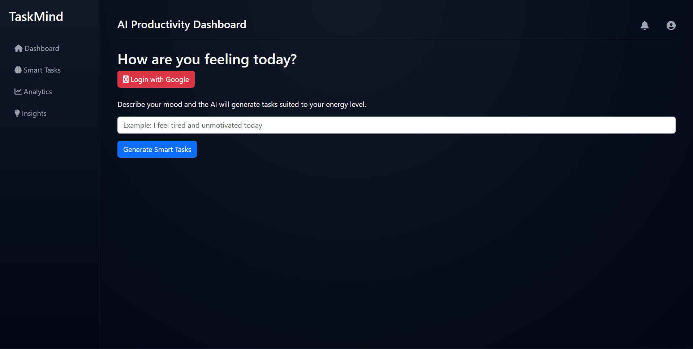
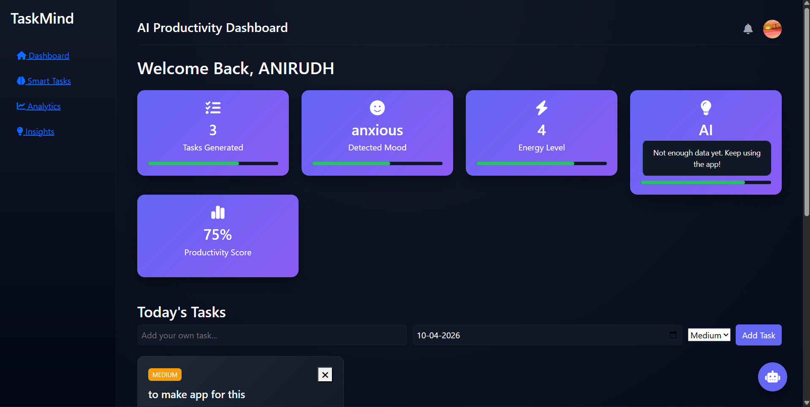

# AI Health-Aware Task Manager

An intelligent productivity system that generates tasks based on a user's **mood and energy level** using AI.

The system analyzes the user's emotional state and dynamically recommends tasks that match their mental capacity, helping improve productivity while avoiding burnout.

---

## Motivation

Most task managers assume users always have the same energy level.

This project explores a different idea:

**Productivity tools should adapt to human mental states.**

---
## Features

### AI Mood Analysis
Analyzes user input and detects:
- Mood
- Energy level (1–10)
  
---

## Screenshots
## Log-in

### Dashboard

### Smart Task Generation
AI generates tasks tailored to the user's current energy level.

Example:

Low energy:
- Review notes
- Organize files
- Plan tomorrow

High energy:
- Deep research
- Coding problems
- Build project modules

---

### AI Productivity Assistant
Built-in AI chat assistant that helps with:
- productivity advice
- study planning
- task breakdown
- focus techniques

---

### Manual Task Management
Users can also add their own tasks with:
- priority levels
- due dates

---

### Drag and Drop Task Ordering
Tasks can be rearranged using drag-and-drop interaction.

---

### Productivity Score
Tracks how many tasks were completed and calculates a productivity percentage.

---

### Analytics Dashboard
Visual insights using charts:
- energy trends
- productivity progress

---

### Multi-User Login
Users can log in using Google authentication.

Each user has:
- separate task history
- personal analytics

---

## Tech Stack

### Backend
- Python
- Flask

### Frontend
- HTML
- CSS
- JavaScript

### AI
- Groq API
- Llama-3.1-8B model

### Visualization
- Chart.js

### Authentication
- Google OAuth

---

## Future Improvements

- Calendar view for task deadlines
- AI task auto-scheduling
- Mobile responsive UI
- Weekly productivity reports
- AI burnout detection

## Author

**Anirudh Varshney**

GitHub:  
https://github.com/Anirudh-715

---

